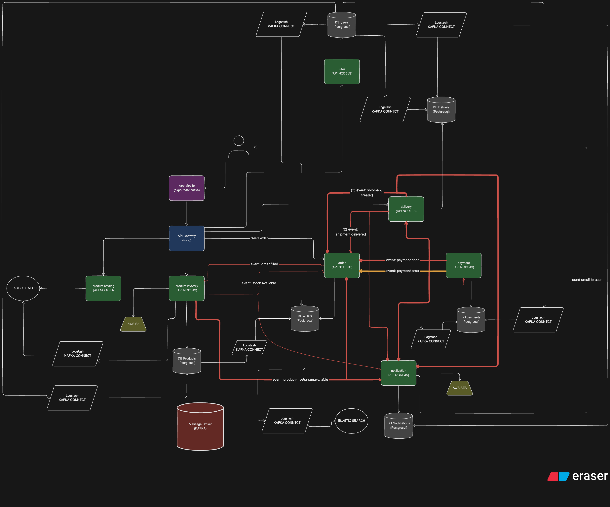

# Teste para Desenvolvedor(a) Back-End Node.js/Nest.js

## Link para o que eu pensei/planejei fazer está no eraser com comentários

[Link para a documentação no Eraser com comentários](https://app.eraser.io/workspace/bq62lo9hU9W9Rk7hD9Ls?origin=share)



Tempo de desenvolvimento: [](https://wakatime.com/badge/user/9ea7b7c5-e5b7-4c24-aa4e-ca4bef7484b7/project/927f8b31-2c0b-42c4-823a-9e977ee41bc5)

## Como rodar o projeto

### Configuração de Variáveis de Ambiente

Antes de iniciar, configure as variáveis de ambiente:

```bash
cp .env.example .env
```

### Passos para executar

1. Instale o pnpm globalmente (se ainda não tiver):

   ```bash
   npm i -g pnpm
   ```

2. Instale as dependências:

   ```bash
   pnpm install
   ```

3. Suba a infraestrutura com Docker Compose:

   ```bash
   cd ./infra/docker
   docker compose up -d
   ```

4. Precisa adicionar o arquivo `elasticsearch.properties` que está na pasta `infra/docker/kafka/connectors` no control center do kafka para que ele possa enviar os eventos para o elasticsearch.

5. Precisa rodar as migrations na pasta root do projeto com o comando:

   ```bash
   pnpm run db:migrate
   ```

6. Em outro terminal (na raiz do projeto), rode as aplicações em modo desenvolvimento:

   ```bash
   pnpm run dev:apps
   ```
